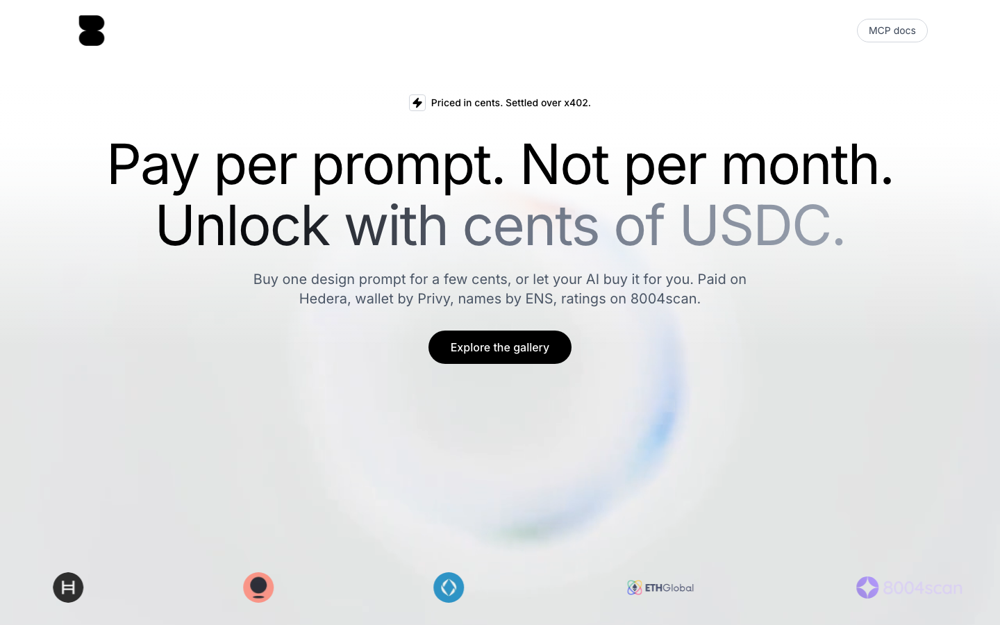
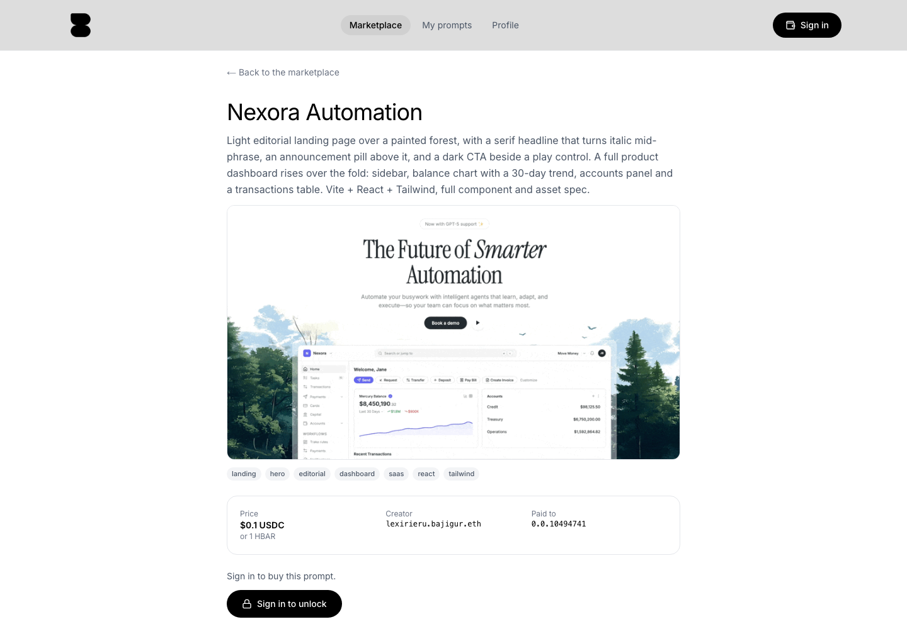
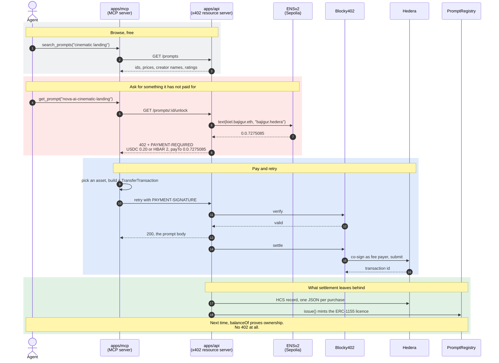

<div align="center">

# Bajigur

### A marketplace your AI can shop at. It finds the prompt, pays for it on-chain, and uses it, without asking you for a card.

**Pay-per-use design prompts, settled with [x402 v2](https://x402.org) on [Hedera](https://hedera.com) testnet.**
Buy one prompt for a few cents instead of a monthly plan. A purchase mints an ERC-1155 licence to
your wallet, so the same prompt is free to read again from any client, forever.

<br/>

[](https://hashscan.io/testnet)
[](https://hashscan.io/testnet/contract/0x59de4C018968E0357EeF77042dD2Fc2ff33e1418)
[](https://github.com/bajigurxyz/bajigur/actions/runs/34689754624)
[](https://ethglobal.com/events/ethonline2026)

**[Live App](https://app.bajigur.xyz)** · **[MCP Server](https://bajigur.xyz/mcp)** ·
**[API](https://api.bajigur.xyz/prompts)** · **[OpenAPI](https://api.bajigur.xyz/openapi.json)** ·
**[Explorer](https://hashscan.io/testnet/contract/0x59de4C018968E0357EeF77042dD2Fc2ff33e1418)**

<br/>



</div>

---

## The problem

An AI agent can write your landing page, but it cannot buy the one asset that would make it good.
Every marketplace on the internet assumes a human with a card, a checkout form and a subscription.
So the agent either scrapes something it has no right to, or it stops and asks you.

Meanwhile the person who made that asset gets nothing, because the only way to sell a single prompt
for twenty cents is to first build a payments company.

**The work exists. The buyer exists. There is no counter where the two can meet.**

---

## What Bajigur does

Bajigur is a shop for motion and web design prompts where the buyer can be a person or the agent
working for them. Every prompt carries its own price, usually a few cents, and you pay for the one
you use.

The three parts that normally live in three different products are one flow here:

| | |
|---|---|
| **Payment is the protocol** | An unpaid request gets a real HTTP `402` with the creator's Hedera account inside it. The agent pays and retries. There is no checkout page, no API key, no invoice. |
| **The name is the payout address** | A creator's payout account is not a row in our database. It is the `bajigur.hedera` text record on their ENSv2 name, read live at the moment we quote a price. |
| **The licence is the access control** | Settlement mints an ERC-1155 to the buyer. That token is what grants access, so our records can never disagree with who can open a prompt. |
| **The rating is the buyer's, not ours** | Only a wallet holding a licence can rate a creator, and the rating is written to ERC-8004 on Hedera, signed and paid by that buyer's own wallet. |

<div align="center">

<br/>
<sub>One live prompt. The creator is an ENS name, the price is quoted in both USDC and HBAR, and the account it pays is on the page.</sub>
</div>

---

## Live on public testnets, verify it yourself

Nothing below needs an account, a key or a checkout. Paste any of it into a terminal.

**See the payment challenge itself,** with the creator's Hedera account inside it:

```bash
curl -sD- -o/dev/null https://api.bajigur.xyz/prompts/nova-ai-cinematic-landing/unlock \
  | grep -i payment-required | cut -d' ' -f2 | base64 -d | jq '.accepts'
```

**Let an agent buy one.** Paste `https://mcp.bajigur.xyz/mcp` into Claude Desktop, Claude Code or
Cursor and ask it to find a cinematic landing page prompt on Bajigur. Sign-in is OAuth against the
web app. Nothing is cloned and nothing is installed.

**Look at a creator,** their payout account, their prompts and what buyers said:

```bash
curl -s https://api.bajigur.xyz/creators/kiel.bajigur.eth | jq
```

### Contracts

| Contract | Where |
|---|---|
| **PromptRegistry**, listings and ERC-1155 licences | Hedera testnet [`0x59de4C01…f33e1418`](https://hashscan.io/testnet/contract/0x59de4C018968E0357EeF77042dD2Fc2ff33e1418), verified, `0.0.10462346` |
| **BajigurRegistrar**, one free `.bajigur.eth` per wallet | Sepolia [`0x418b68e1…e3250976`](https://sepolia.etherscan.io/address/0x418b68e12e29901362174d36b6fda230e3250976), verified |
| **ERC-8004 IdentityRegistry** | Hedera testnet [`0x8004A818…A494BD9e`](https://hashscan.io/testnet/contract/0.0.7919997), service agent **111**, creator agent **115** |
| **ERC-8004 ReputationRegistry** | Hedera testnet [`0x8004B663…B7388713`](https://hashscan.io/testnet/contract/0.0.7919998) |
| **HCS audit topic** | [`0.0.10462113`](https://hashscan.io/testnet/topic/0.0.10462113) |
| **ENSv2 `bajigur.eth`** | Sepolia, resolver [`0x7f381419…0615487f6`](https://sepolia.etherscan.io/address/0x7f381419050525025bBB6811CF5821E0615487f6), subregistry [`0x9673702a…5F59461c`](https://sepolia.etherscan.io/address/0x9673702a3C850fa1c41d94C908083Fc85F59461c) |

### Receipts, not screenshots

| Claim | Proof |
|---|---|
| **An agent paid in USDC over x402** | [`0.0.9185802@1789055565`](https://hashscan.io/testnet/transaction/0.0.9185802-1789055565-700887673), `SUCCESS` |
| **An agent paid in HBAR instead** | [`0.0.9185802@1789056622`](https://hashscan.io/testnet/transaction/0.0.9185802-1789056622-039948026) |
| **A payment with no key on the machine** | [`0.0.9185802@1789131132`](https://hashscan.io/testnet/transaction/0.0.9185802-1789131132-231709809), agent token only, signed through Privy |
| **A named wallet paid its creator directly** | [`0.0.7162784@1789206663`](https://hashscan.io/testnet/transaction/0.0.7162784-1789206663-898896205) |
| **A buyer rated a creator on ERC-8004** | [`0.0.10497977@1789213244`](https://hashscan.io/testnet/transaction/0.0.10497977-1789213244-887394093), signed and paid by the buyer |
| **A wallet with no ETH claimed a name** | [Sepolia `0xda2fd533…a952531`](https://sepolia.etherscan.io/tx/0xda2fd533ee092a1719a612d7ef3ea8aa6e4781598389453808030a8f3a952531), payout record written in the same transaction |
| **Every settlement is logged** | [HCS topic `0.0.10462113`](https://hashscan.io/testnet/topic/0.0.10462113), one JSON record per purchase |
| **The contracts pass** | [CI green](https://github.com/bajigurxyz/bajigur/actions/runs/34689754624), `forge test` 15 passing, plus 122 TypeScript tests |

---

## How it works

An agent wants a prompt. It has no account with us and no card. Ninety seconds later the creator has
been paid and the agent has the text.


The same story call by call, including the ENS lookup that decides who gets paid:



---

## Three tools, and no installation

Paste one URL into any MCP client and the agent has a shop it can use on its own.

| Tool | What it does | Costs |
|---|---|---|
| **`search_prompts`** | Search the catalogue. Returns ids, prices in both assets, the creator's ENS name and their ERC-8004 rating. | Free |
| **`my_licenses`** | List what this wallet already owns, re-readable from any client. | Free |
| **`get_prompt`** | Return the full text. Pays the listed price over x402 if this wallet does not own it yet, and returns the Hedera transaction id with the text. | The creator's price |

It runs two ways. **Hosted** at `https://mcp.bajigur.xyz/mcp`, where you sign in with OAuth and the
API signs for you, so no private key ever touches the machine. Or **locally** over stdio with your
own Hedera key, if you would rather hold it yourself.

```jsonc
// Claude Desktop, Settings Connectors Add custom connector
{ "url": "https://mcp.bajigur.xyz/mcp" }
```

The server is stateless Streamable HTTP, so it runs on serverless with no session store.
Full instructions, including the OAuth flow, are at **[bajigur.xyz/mcp](https://bajigur.xyz/mcp)**.

---

## x402 on Hedera, settled by Blocky402

Only `GET /prompts/:id/unlock` is paid. The price and the payout account are resolved per request
from the prompt itself, so each creator is paid directly rather than through a platform float.

Every prompt is priced twice, in **USDC** (HTS token [`0.0.429274`](https://hashscan.io/testnet/token/0.0.429274))
and in **HBAR**, and both appear in the same `402` so the client chooses which asset to spend.

**Contracts never sit in the payment path.** An x402 `payTo` on Hedera has to be a `0.0.x` account
and not a contract, so the facilitator settles a plain HTS transfer and `PromptRegistry` only records
what happened afterwards. That constraint shaped the architecture, and it is the reason a creator is
paid by the network rather than by us.

A returning buyer never sees a `402` again. We check `balanceOf` through the mirror node's free
`contracts/call` endpoint, so proving you already own something costs nothing.

<sub>Implementation: [`apps/api/src/x402.ts`](apps/api/src/x402.ts) for the resource server,
[`apps/mcp/src/pay.ts`](apps/mcp/src/pay.ts) for the client side.</sub>

---

## ENSv2, where the name is the payout address

`bajigur.eth` has its own ENSv2 subregistry on Sepolia behind a registrar we wrote, which enforces
the rules in Solidity rather than in our backend: **one free name per wallet, three to thirty-two
characters, ten years.**

The part that matters is what the name carries. A creator's payout account is the `bajigur.hedera`
text record on their own name, read at the moment we quote a payment. Change the record and the next
payment lands somewhere else. We physically cannot hold a creator's payout address hostage, because
we never held it.

A user who has never owned ETH still gets one. `claimFor` registers the name to **their** wallet and
writes their Hedera account into the record **in the same transaction**, with the platform paying the
Sepolia gas. A name without that record would quietly send its owner's buyers to us, so the two
cannot be separated.

<sub>Implementation: [`contracts/src/BajigurRegistrar.sol`](contracts/src/BajigurRegistrar.sol),
[`apps/api/src/ens.ts`](apps/api/src/ens.ts).</sub>

---

## Privy, a wallet that pays without a popup

A user signs in with an email. Privy creates the embedded wallet, we create and fund their Hedera
account and associate USDC, and they grant Bajigur a signer through a key quorum. From then on the
API signs their x402 payments with `secp256k1_sign`.

That is what removes the wallet popup from every purchase, and it is what lets someone who has never
held a token buy a prompt with one button.

**Where the caps live, and why.** Privy policies cannot gate raw `secp256k1_sign`, so we could not
put spending limits there. Our API decodes the Hedera transaction body **before** signing and refuses
anything that does not debit the user's own account, credit a known creator payout account, and stay
under the cap baked into that user's token. The user's own wallet also signs and pays for their
ERC-8004 rating, so a review belongs to the buyer rather than to us.

<sub>Implementation: [`apps/api/src/agent.ts`](apps/api/src/agent.ts) for signing and the caps,
[`apps/web/src/lib/useWalletAccess.ts`](apps/web/src/lib/useWalletAccess.ts) for granting the signer.</sub>

---

## ERC-8004, reputation that the creator cannot write

Identity and reputation registries are already deployed on Hedera testnet as singletons, so this is
Hedera and ERC-8004 at the same time: HBAR for gas, HashScan for the receipts, no bridge.

Only a wallet holding a licence for one of a creator's prompts may rate them, and never the creator
themselves, because `giveFeedback` reverts on self-feedback. The first time somebody rates a creator
we mint that creator's agent, write their ENS name into its onchain metadata, hand the token to the
creator's own wallet, and write `erc8004` onto their ENS name. Name and agent then point at each
other in both directions.

The score is shown as a **signed total and a headcount, never as stars**. `getSummary` adds signed
feedback up, so two buyers leaving +1 and -1 land on zero and one buyer leaving +5 outranks five
leaving +1. A creator nobody has rated shows nothing at all, because being unrated is not the same as
being rated badly.

---

## Try it yourself

| | | |
|---|---|---|
| **1** | **As an agent** | Paste `https://mcp.bajigur.xyz/mcp` into Claude Desktop or Cursor. Ask for a cinematic landing page prompt. Watch it hit the `402`, pay, and hand you the text with a transaction id. |
| **2** | **As a person** | Open [app.bajigur.xyz](https://app.bajigur.xyz), sign in with an email. Privy makes the wallet, we make the Hedera account, you claim a free `.bajigur.eth` name. |
| **3** | **Buy one** | One button. No seed phrase, no extension, no signing popup. The creator is paid by the network, not by us. |
| **4** | **Check the receipt** | Every purchase leaves a Hedera transaction, an HCS record and an ERC-1155 in your wallet. All three are public. |
| **5** | **Publish your own** | Set your own price in both USDC and HBAR. Buyers pay your name, and you can see exactly who bought. |
| **6** | **Verify the lot** | [`docs/verify.md`](docs/verify.md) is a list of copy-and-paste commands that check every claim on this page against Hedera and Sepolia directly. |

---

## Layout

One repository, a Bun workspace monorepo driven by Turborepo. Around 9,300 lines of TypeScript and
Solidity across 100 source files, plus the tests.

| Workspace | What's inside | Verify it |
|---|---|---|
| **[`apps/api`](apps/api)** | Bun + Hono. The x402 resource server, publishing, name claiming, buyer lists, licences, creator reputation. | `bun run test` in `apps/api`, **36 passing** |
| **[`apps/mcp`](apps/mcp)** | The same service as three MCP tools, with the x402 client. Hosted over Streamable HTTP with OAuth, or local over stdio. | **14 passing** |
| **[`apps/web`](apps/web)** | Next.js 16. Sign-in, wallet setup, name claiming, purchases, publishing, licences. | **45 passing** |
| **[`apps/landingpage`](apps/landingpage)** | Next.js 16. The marketing site and the MCP documentation. | **24 passing** |
| **[`contracts`](contracts)** | Foundry. `PromptRegistry` on Hedera, `BajigurRegistrar` on Sepolia, the ERC-8004 registration script. | `forge test`, **15 passing**, [CI green](https://github.com/bajigurxyz/bajigur/actions/runs/34689754624) |
| **[`packages/core`](packages/core)** | Shared types and utilities. Apps never import from each other. | **3 passing** |

Every directory with real work carries its own `CLAUDE.md` explaining how that part behaves and why.

---

## Tech stack

### `contracts`

| Layer | What we use |
|---|---|
| Language | **Solidity `^0.8.30`** |
| Toolchain | **Foundry**: `forge`, `cast`. OpenZeppelin and forge-std as submodules |
| On Hedera | `PromptRegistry`, an **ERC-1155** with `AccessControl`. Listings, content hashes, and licence minting gated to the API |
| On Sepolia | `BajigurRegistrar`, an **ENSv2** registrar over a `PermissionedRegistry`, writing text records through an `OwnedResolver` |
| Tests | **`forge test`, 15 passing**, in CI on every push that touches `contracts/` |

### `apps/api`

| Layer | What we use |
|---|---|
| Runtime | **Bun** with **Hono 4**, deployed on **Railway** behind `api.bajigur.xyz` |
| Payments | **`@x402/hono`** over **`@x402/core`** and **`@x402/hedera`** `2.25.0`, settled by the **Blocky402** facilitator |
| Chain | **`@hiero-ledger/sdk` 2.85.0**, pinned to the exact version `@x402/hedera` uses. Mirror node for reads, so no indexer |
| Wallets | **`@privy-io/node` 0.34** for delegated signing, `jose` for the agent tokens, `@noble/curves` for key recovery |
| Names | **viem 2.56** against `UniversalResolverV2` on Sepolia, 60s cache |
| Storage | **Postgres** on Railway for published prompt bodies. Seed prompts stay in the bundle |
| Tests | **`bun:test`, 36 passing**, over `app.request()` with a stubbed facilitator, no network |

### `apps/mcp`

| Layer | What we use |
|---|---|
| Protocol | **`@modelcontextprotocol/sdk` 1.30**, stateless Streamable HTTP, plus stdio for local use |
| Payments | **`@x402/fetch`** with a shared spend policy: an explicit asset allowlist and a selector, so HBAR and USDC both work |
| Auth | **OAuth 2.1** with PKCE S256, RFC 8414 discovery, RFC 7591 dynamic registration, and RFC 9728 protected-resource metadata |
| Signing | A local Hedera key, or an external signer that calls the API, which signs through Privy |
| Tests | **`bun:test`, 14 passing** |

### `apps/web` and `apps/landingpage`

| Layer | What we use |
|---|---|
| Framework | **Next.js 16** App Router, **React 19.2**, the **React Compiler**, on **Vercel** |
| Styling | **Tailwind CSS v4**, `lucide-react`, **GSAP 3.15** for the navigation marker and scroll behaviour |
| Web3 | **`@privy-io/react-auth` 3.42** for sign-in and the embedded wallet. No wagmi, no injected wallet, no signing popup |
| Payments | Run entirely in route handlers. The `402` challenge is not exposed cross-origin, which also keeps the agent token in an httpOnly cookie and the Hedera SDK out of the client bundle |
| Tests | **Vitest 3** with jsdom, **69 passing** across both apps |

### Repository

**Bun** workspaces with **Turborepo**. **Biome** for formatting and import sorting, `eslint-config-next`
for the React rules. TypeScript 5.9 with `tsc --noEmit` across the workspace. Conventional Commits,
and everything in the repository is written in English.

```bash
bun install
bun run dev # every app
bun run typecheck && bun run lint && bun run test && bun run build
bun run contracts:test
```

---

## Honest limitations

We would rather you read this than find it.

- **Testnets, deliberately.** Hedera testnet and Sepolia. Real transactions, real contracts, no real money.
- **The caps are ours, not Privy's.** Privy policies cannot gate raw signing, so the spending limits live in our API. That is application code holding a security boundary, and we say so rather than implying otherwise.
- **The caps are set high for judging.** `AGENT_CAP_USD` and `AGENT_CAP_HBAR` are 1000 each so nobody hits a limit mid-demo. Real money wants a real cap.
- **`search_prompts` matches literal substrings.** Ask for `animation` and you get nothing, because the catalogue says `animated`. It is honest keyword matching, not search.
- **Discovery is a hole.** The service is registered on ERC-8004 and published in the x402 bazaar shape, but no agent finds Bajigur on its own yet. Somebody has to hand it the URL.
- **Rate limited publishing.** Five prompts per wallet per hour, because each one mints an onchain registration the platform pays for.

---

## Team

| | Role | GitHub |
|---|---|---|
| **Axel** | Frontend, `apps/web` and `apps/landingpage` | [@Lexirieru](https://github.com/Lexirieru) |
| **Kiel** | Contracts and backend, `contracts/`, `apps/api`, `apps/mcp` | [@yeheskieltame](https://github.com/yeheskieltame) |

---

<div align="center">
<br/>

**Built for [ETHGlobal ETHOnline 2026](https://ethglobal.com/events/ethonline2026)** · Hedera · Privy · ENS

[Live App](https://app.bajigur.xyz) · [MCP Server](https://bajigur.xyz/mcp) ·
[API](https://api.bajigur.xyz/prompts) · [Verify every claim](docs/verify.md)

<sub>Hedera testnet and Sepolia. Real contracts, real transactions, testnet money.</sub>

</div>
